# a1.TextView

## 1.1基础属性详解


## 1.2带阴影的textview


## 1.3实现跑马灯效果的textview


### 1.3.1自动获取焦点

```java
package com.eninix.androidtest;

import android.content.Context;
import android.util.AttributeSet;
import android.widget.TextView;

import androidx.annotation.Nullable;

public class MyTextView extends TextView {

    public MyTextView(Context context) {
        super(context);
    }

    public MyTextView(Context context, @Nullable AttributeSet attrs) {
        super(context, attrs);
    }

    public MyTextView(Context context, @Nullable AttributeSet attrs, int defStyleAttr) {
        super(context, attrs, defStyleAttr);
    }

    @Override
    public boolean isFocused() {
        return true;
    }
}
```

```xml
<?xml version="1.0" encoding="utf-8"?>
<LinearLayout xmlns:android="http://schemas.android.com/apk/res/android"
    android:layout_width="match_parent"
    android:layout_height="match_parent"
    android:orientation="vertical">

    <com.eninix.androidtest.MyTextView
        android:id="@+id/tv_one"

        android:layout_width="match_parent"
        android:layout_height="200dp"
        android:background="@color/red"

        android:singleLine="true"
        android:ellipsize="marquee"
        android:marqueeRepeatLimit="marquee_forever"
        android:focusable="true"
        android:focusableInTouchMode="true"
        android:clickable="true"

        android:shadowColor="@color/teal_200"
        android:shadowDx="10"
        android:shadowDy="10"
        android:shadowRadius="10"

        android:gravity="center_vertical"
        android:text="@string/tv_one"
        android:textColor="@color/black"
        android:textSize="40sp"
        android:textStyle="italic" />

</LinearLayout>
```

或者

```xml
<?xml version="1.0" encoding="utf-8"?>
<LinearLayout xmlns:android="http://schemas.android.com/apk/res/android"
    android:layout_width="match_parent"
    android:layout_height="match_parent"
    android:orientation="vertical">

    <TextView
        android:id="@+id/tv_one"

        android:layout_width="match_parent"
        android:layout_height="200dp"
        android:background="@color/red"

        android:singleLine="true"
        android:ellipsize="marquee"
        android:marqueeRepeatLimit="marquee_forever"
        android:focusable="true"
        android:focusableInTouchMode="true"
        android:clickable="true"

        android:shadowColor="@color/teal_200"
        android:shadowDx="10"
        android:shadowDy="10"
        android:shadowRadius="10"

        android:gravity="center_vertical"
        android:text="@string/tv_one"
        android:textColor="@color/black"
        android:textSize="40sp"
        android:textStyle="italic" >

        <requestFocus/>
    </TextView>

</LinearLayout>
```

# 2.Button

## 2.1StateListDrawable


```xml
<?xml version="1.0" encoding="utf-8"?>
<LinearLayout xmlns:android="http://schemas.android.com/apk/res/android"
    android:layout_width="match_parent"
    android:layout_height="match_parent"
    android:orientation="vertical">

    <Button
        android:layout_width="200dp"
        android:layout_height="100dp"
        android:background="@drawable/btn_color_selector"
        android:textColor="@color/black"
        android:text="普通の釦">
    </Button>

</LinearLayout>
```

## 2.2Button事件处理

```java
package com.eninix.androidtest;

import androidx.appcompat.app.AppCompatActivity;

import android.os.Bundle;
import android.util.Log;
import android.view.MotionEvent;
import android.view.View;
import android.widget.Button;
import android.widget.TextView;

public class MainActivity extends AppCompatActivity {

    private static final String TAG = "eninix";

    @Override
    protected void onCreate(Bundle savedInstanceState) {
        super.onCreate(savedInstanceState);
        setContentView(R.layout.activity_main);

        TextView tv_one = findViewById(R.id.tv_one);
        // tv_one.setText("Hello World!");

        Button btn = findViewById(R.id.btn);

        // 点击事件
        btn.setOnClickListener(new View.OnClickListener() {
            @Override
            public void onClick(View v) {
                Log.e(TAG,"onClick");
            }
        });
        // 长按事件
        btn.setOnLongClickListener(new View.OnLongClickListener() {
            @Override
            public boolean onLongClick(View v) {
                Log.e(TAG,"onLongClick");
                return false; // 为true时,click不执行
            }
        });
        //触摸事件
        btn.setOnTouchListener(new View.OnTouchListener() {
            @Override
            public boolean onTouch(View v, MotionEvent event) {
                Log.e(TAG,"onTouch");
                return false; // 为true时,click和longclick不执行
            }
        });

    }
}
```

或者

```java
package com.eninix.androidtest;

import androidx.appcompat.app.AppCompatActivity;

import android.os.Bundle;
import android.util.Log;
import android.view.MotionEvent;
import android.view.View;
import android.widget.Button;
import android.widget.TextView;

public class MainActivity extends AppCompatActivity {

    private static final String TAG = "eninix";

    @Override
    protected void onCreate(Bundle savedInstanceState) {
        super.onCreate(savedInstanceState);
        setContentView(R.layout.activity_main);

    public void btnClick(View view) {
        
    }
}
    /*
       <Button
        android:id="@+id/btn"

        android:layout_width="200dp"
        android:layout_height="100dp"
        android:background="@drawable/btn_color_selector"

        android:onClick="btnClick" // 此处

        android:textColor="@color/black"
        android:text="普通の釦"/>
    */
```

# 3.EditText

```
android:hint 输入提示
android:textColorHint 输入提示文字的颜色
android:inputType 输入类型
android:drawableXxxx 输入框指定方位添加图片
android:drawablePadding 设置图片与输入内容间距
android:paddingXxxx 设置内容与边框间距
android:background 背景色
```

```java
package com.eninix.androidtest;

import androidx.appcompat.app.AppCompatActivity;

import android.os.Bundle;
import android.util.Log;
import android.view.MotionEvent;
import android.view.View;
import android.widget.Button;
import android.widget.EditText;
import android.widget.TextView;

public class MainActivity extends AppCompatActivity {

    private static final String TAG = "EGI";
    private EditText et;

    @Override
    protected void onCreate(Bundle savedInstanceState) {
        super.onCreate(savedInstanceState);
        setContentView(R.layout.activity_main);


        // coding...
        Button btn = findViewById(R.id.btn);
        et = findViewById(R.id.et);

        btn.setOnClickListener(new View.OnClickListener() {
            @Override
            public void onClick(View v) {
                String text = et.getText().toString();
                Log.e(TAG, text);
            }
        });

    }
}
```

```xml
<?xml version="1.0" encoding="utf-8"?>
<LinearLayout xmlns:android="http://schemas.android.com/apk/res/android"
    android:layout_width="match_parent"
    android:layout_height="match_parent"
    android:orientation="vertical">

    <EditText
        android:id="@+id/et"

        android:layout_width="250dp"
        android:layout_height="100dp"

        android:inputType="phone"

        android:hint="请输入用户名!"
        android:textColorHint="@color/black" />

    <EditText
        android:layout_width="250dp"
        android:layout_height="100dp"

        android:inputType="textPassword"

        android:drawableLeft="@drawable/ic_baseline_accessibility_24"
        android:paddingLeft="50dp"
        android:drawablePadding="30dp"

        android:hint="请输入用户名!"
        android:textColorHint="@color/black" />

    <Button

        android:id="@+id/btn"

        android:layout_width="wrap_content"
        android:layout_height="wrap_content"/>

</LinearLayout>
```

# 4.ImageView

```
android:src 图片资源
android:scaleType 图片缩放类型
android:maxHeigh 最大高
android:maxWidth 最大宽
android:adjustViewBounds 调整view界限 与上述最大宽高联合使用
```

## 4.1缩放类型

```
firStart 保持宽高比缩放,直至长边与imageview的边相等,缩放完成后置于ImageView左上角
fitCenter 同上,置于中间
fitEnd 同上,置于右下角
fitXY 拉伸
center 置于中心,超出部分裁剪处理
centerCrop 置于中心,等比缩放,直到完全覆盖imageview,超出部分裁剪处理
centerInside 置于中心,等比缩放,直至完全显示
matrix 不改变原图,从左上开始绘图,超出部分裁剪处理
```

# 5.ProgressBar

```
android:max 进度条最大值
android:progress 已完成进度
android:indeterminate 如果为true则不精确显示进度
style="?android:attr/progressBarStyleHorizontal" 水平进度条 //可能无用
style="@style/Widget.AppCompat.ProgressBar.Horizontal" 水平进度条
```

```java
public class MainActivity extends AppCompatActivity {

//     预定义一些进度条
    private ProgressBar progressBar;
    private ProgressBar progressBar2;

    @Override
    protected void onCreate(Bundle savedInstanceState) {
        super.onCreate(savedInstanceState);
        setContentView(R.layout.activity_main);

        progressBar = findViewById(R.id.pb);
        progressBar2 = findViewById(R.id.pd2);

    }

//    设置进度条的显示与隐藏
    public void bClick(View view) {
        progressBar.setVisibility(progressBar.getVisibility() == View.GONE ? View.VISIBLE : View.GONE);
    }

//    增加进度条的进度
    public void load(View view) {
        progressBar2.setProgress(progressBar2.getProgress() + 10);
    }
}
```

# 6.Notification

## 6.1


## 6.2


## 6.3


```java
public class MainActivity extends AppCompatActivity {

    // 创建 NotificationManager对象
    private NotificationManager manager;
    // 创建 Notification对象
    private Notification notification;

    @Override
    protected void onCreate(Bundle savedInstanceState) {
        super.onCreate(savedInstanceState);
        setContentView(R.layout.activity_main);

        //获取 NotificationManager对象
        manager = (NotificationManager) getSystemService(NOTIFICATION_SERVICE);

        //安卓8之后需要这个东西 NotificationChannel
        if (Build.VERSION.SDK_INT >= Build.VERSION_CODES.O) {
            NotificationChannel channel = new NotificationChannel("enin", "Test", NotificationManager.IMPORTANCE_HIGH);
            manager.createNotificationChannel(channel);
        }

        //设置通知信息
        notification = new NotificationCompat.Builder(this, "enin")
                .setContentTitle("致所有成员")   //标题
                .setContentText("世界はこんなに美しい、見付かなかった。") //内容
                .setSmallIcon(R.drawable.ic_test03) // 小图标  // 此及以上三个为必需
                .setLargeIcon(BitmapFactory.decodeResource(getResources(), R.drawable.test)) // 大图标  // 此及以下非必需
                .setColor(Color.parseColor("#ff0000")) // 小图标颜色
                .setAutoCancel(true) // 点击后自动取消
                .build();

    }

    //发送通知按钮所绑定的函数
    public void sendNotification(View view) {
        manager.notify(1, notification);
    }

    //消除通知…
    public void cacelNotification(View view) {
        manager.cancel(1);
    }
}
```

# 7.Toolbar


```xml
<?xml version="1.0" encoding="utf-8"?>
<LinearLayout xmlns:android="http://schemas.android.com/apk/res/android"
    xmlns:app="http://schemas.android.com/apk/res-auto"
    xmlns:tools="http://schemas.android.com/tools"
    android:layout_width="match_parent"
    android:layout_height="match_parent"
    android:orientation="vertical"
    tools:context=".MainActivity">

    <androidx.appcompat.widget.Toolbar
        android:id="@+id/tb"
        android:layout_width="match_parent"
        android:layout_height="?attr/actionBarSize"
        android:background="@color/teal_200"
        app:logo="@mipmap/ic_launcher_round"
        app:navigationIcon="@drawable/ic_menu"
        app:subtitle="这是子标题"
        app:subtitleTextColor="@color/teal_700"
        app:title="这是标题"
        app:titleMarginStart="50dp"
        app:titleTextColor="@color/red" />

    <androidx.appcompat.widget.Toolbar
        android:id="@+id/tb2"
        android:layout_width="match_parent"
        android:layout_height="?attr/actionBarSize"
        android:background="@color/teal_200"
        app:logo="@mipmap/ic_launcher_round"
        app:navigationIcon="@drawable/ic_menu"
        app:subtitle="这是子标题"
        app:subtitleTextColor="@color/teal_700"
        app:title="这是标题"
        app:titleMarginStart="50dp"
        app:titleTextColor="@color/red" />

    <androidx.appcompat.widget.Toolbar
        android:layout_width="match_parent"
        android:layout_height="?attr/actionBarSize"
        android:background="@color/teal_200"
        app:logo="@mipmap/ic_launcher_round"
        app:navigationIcon="@drawable/ic_menu"
        app:titleTextColor="@color/red">

        <TextView
            android:layout_width="wrap_content"
            android:layout_height="wrap_content"
            android:layout_gravity="center"
            android:gravity="center"
            android:text="标题-居中" />

    </androidx.appcompat.widget.Toolbar>
</LinearLayout>
```

```java
package com.eninix.my_toolbar;

import androidx.appcompat.app.AppCompatActivity;
import androidx.appcompat.widget.Toolbar;   //注意这里的包

import android.os.Bundle;
import android.util.Log;
import android.view.View;
import android.widget.QuickContactBadge;


public class MainActivity extends AppCompatActivity {

    Toolbar toolbar;
    Toolbar toolbar2;

    @Override
    protected void onCreate(Bundle savedInstanceState) {
        super.onCreate(savedInstanceState);
        setContentView(R.layout.activity_main);

        toolbar = findViewById(R.id.tb);

        //toolbar的navigationIcon被点击的事件
        toolbar.setNavigationOnClickListener(new View.OnClickListener() {
            @Override
            public void onClick(View v) {
                Log.e("enin", "tb被点击了");
            }
        });

        toolbar2 = findViewById(R.id.tb2);

        //在java里设置toolbar的属性
        toolbar2.setNavigationIcon(R.drawable.ic_back);
        toolbar2.setTitle("标题-java");
        toolbar2.setNavigationOnClickListener(new View.OnClickListener() {
            @Override
            public void onClick(View v) {
                Log.e("enin", "tb222被点击了");
            }
        });
    }
}
```

# 8.AlertDialog


```java
package com.eninix.my_alertdialog;

import androidx.appcompat.app.AlertDialog;
import androidx.appcompat.app.AppCompatActivity;

import android.content.DialogInterface;
import android.os.Bundle;
import android.util.Log;
import android.view.View;

public class MainActivity extends AppCompatActivity {

    @Override
    protected void onCreate(Bundle savedInstanceState) {
        super.onCreate(savedInstanceState);
        setContentView(R.layout.activity_main);
    }

    public void bClick(View view) {
        // Dialog构建器
        AlertDialog.Builder builder = new AlertDialog.Builder(this);

        builder.setIcon(R.mipmap.ic_launcher_round)
                .setMessage("天気は良いから、散歩しましょう！")
                .setTitle("这是一个对话框")
                .setPositiveButton("下次不来了", new DialogInterface.OnClickListener() {
                    @Override
                    public void onClick(DialogInterface dialog, int which) {
                        Log.e("eninsay","111111");
                    }
                })
                .setNeutralButton("说不准", new DialogInterface.OnClickListener() {
                    @Override
                    public void onClick(DialogInterface dialog, int which) {
                        Log.e("eninsay","222222");
                    }
                })
                .setNegativeButton("下次再来", new DialogInterface.OnClickListener() {
                    @Override
                    public void onClick(DialogInterface dialog, int which) {
                        Log.e("eninsay","333333");
                    }
                })
                .setView(getLayoutInflater().inflate(R.layout.alertdialog_view,null))
                .create()   //此及以下两个需按顺序放在最后
                .show();
    }
}
```

```xml
<?xml version="1.0" encoding="utf-8"?>
<androidx.constraintlayout.widget.ConstraintLayout xmlns:android="http://schemas.android.com/apk/res/android"
    xmlns:app="http://schemas.android.com/apk/res-auto"
    xmlns:tools="http://schemas.android.com/tools"
    android:layout_width="match_parent"
    android:layout_height="match_parent"
    tools:context=".MainActivity">

    <Button
        android:layout_width="wrap_content"
        android:layout_height="wrap_content"
        android:onClick="bClick"
        android:text="显示对话框（AlertDialog）"
        app:layout_constraintBottom_toBottomOf="parent"
        app:layout_constraintEnd_toEndOf="parent"
        app:layout_constraintStart_toStartOf="parent"
        app:layout_constraintTop_toTopOf="parent"
        app:layout_constraintVertical_bias="0.499" />

</androidx.constraintlayout.widget.ConstraintLayout>
```


# 9.PopupWindow


```java
package com.eninix.my_popupwindow;

import androidx.appcompat.app.AppCompatActivity;

import android.app.ActionBar;
import android.os.Bundle;
import android.view.View;
import android.widget.PopupWindow;

public class MainActivity extends AppCompatActivity {

    @Override
    protected void onCreate(Bundle savedInstanceState) {
        super.onCreate(savedInstanceState);
        setContentView(R.layout.activity_main);
    }

    public void bClick(View view) {

        //导入 view
        View popup_view = getLayoutInflater().inflate(R.layout.ppw_view, null);

        //创建 popupWindow 参数： view，宽，高，失去焦点隐藏
        PopupWindow popupWindow = new PopupWindow(popup_view,
                ActionBar.LayoutParams.WRAP_CONTENT, ActionBar.LayoutParams.WRAP_CONTENT
                , true);

        popupWindow.setBackgroundDrawable(getResources().getDrawable(R.drawable.test));

        //popupWindow.dismiss() 退出窗口

        //show 放在最后
        popupWindow.showAsDropDown(view);
    }
}
```

# 10LinearLayout


# 11.RelativeLayout


# 12.FrameLayout


# 13.TableLayout

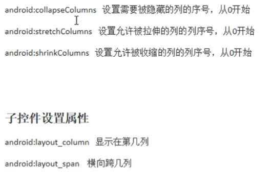

# 14.GridLayout

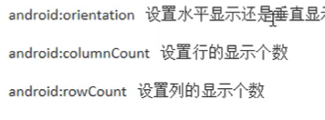

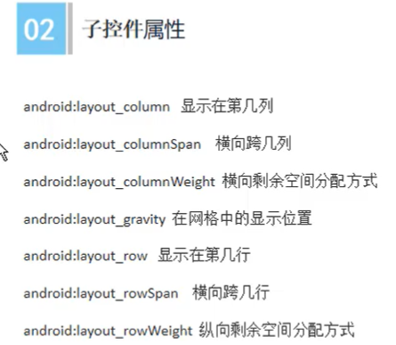

# 15.ConstaintLayout

# 16.ListView

```java
//Bean类
package com.eninix.my_listview;

public class Bean {
    String m_text;

    public String getM_text() {
        return m_text;
    }

    public void setM_text(String m_text) {
        this.m_text = m_text;
    }
}

```

```java
//MainActivity类
package com.eninix.my_listview;

import androidx.appcompat.app.AppCompatActivity;

import android.os.Bundle;
import android.util.Log;
import android.view.View;
import android.widget.AdapterView;
import android.widget.ListView;

import java.util.ArrayList;
import java.util.List;

public class MainActivity extends AppCompatActivity {

    // 创建 item的data 的列表
    private List<Bean> data = new ArrayList<>();

    @Override
    protected void onCreate(Bundle savedInstanceState) {
        super.onCreate(savedInstanceState);
        setContentView(R.layout.activity_main);

        // 给每个item的data复制
        for (int temp = 0; temp < 100; temp++) {
            Bean bean = new Bean();
            bean.setM_text("计数：" + temp);
            data.add(bean);
        }

        //获取 ListView
        ListView listView = findViewById(R.id.lv);
        //把 item放入listView 通过 MyAdapter
        listView.setAdapter(new MyAdapter(data, this));

        //给每个item绑定事件
        listView.setOnItemClickListener(new AdapterView.OnItemClickListener() {
            @Override
            public void onItemClick(AdapterView<?> parent, View view, int position, long id) {
                Log.e("eninsay", "你点击了：" + position);
            }
        });

    }
}
```

```java
//MyAdapter类
package com.eninix.my_listview;

import android.content.Context;
import android.util.Log;
import android.view.LayoutInflater;
import android.view.View;
import android.view.ViewGroup;
import android.widget.BaseAdapter;
import android.widget.TextView;

import java.util.List;

public class MyAdapter extends BaseAdapter {

    private List<Bean> data;
    private Context context;

    public MyAdapter(List<Bean> data, Context context) {
        this.data = data;
        this.context = context;
    }

    // item的数量
    @Override
    public int getCount() {
        return data.size();
    }

    @Override
    public Object getItem(int position) {
        return null;
    }

    @Override
    public long getItemId(int position) {
        return position;
    }

    //返回item，以便进行操作
    @Override
    public View getView(int position, View convertView, ViewGroup parent) {

        //viewHolder定义
        ViewHolder viewHolder;

        // 把item_view，父容器 赋值给 convertView连接起来
        if (convertView == null) {
            //从Context中获得布局填充器,把(xml布局,父容器,可聚焦)文件转为View对象
            convertView = LayoutInflater.from(context).inflate(R.layout.item_view, parent, false);

            //把textview放进viewholder里面
            viewHolder = new ViewHolder();
            viewHolder.textView = convertView.findViewById(R.id.stv);

            //把viewHolder放进convertView的Tag里面
            convertView.setTag(viewHolder);

        } else {
            //否则的话，直接获取convertView的Tag
            viewHolder = (ViewHolder) convertView.getTag();
        }

//        //获取 需要操作的 view
//        TextView textView = convertView.findViewById(R.id.stv);
//        //操作 view
//        textView.setText(data.get(position).getM_text());
        //上述代码优化后
        viewHolder.textView.setText(data.get(position).getM_text());

//        Log.e("eninsay", "size:" + data.size());
        Log.e("eninsay", "滑动到" + position);

        // 将 convertView 返回
        return convertView;
    }

    //为增强性能，可以用一个类把item给记录一下
    private final class ViewHolder {
        TextView textView;
    }

}

```

# 17.RecycleView

在 build.gradle里面导包
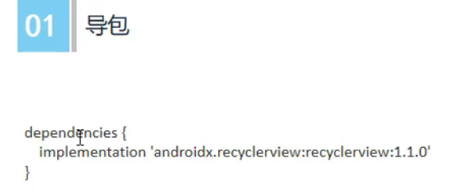

```
implementation 'androidx.recyclerview:recyclerview:1.2.1'
```

```java
//MainActivity类
package com.eninix.my_recycleview;

import androidx.appcompat.app.AppCompatActivity;
import androidx.recyclerview.widget.GridLayoutManager;
import androidx.recyclerview.widget.LinearLayoutManager;
import androidx.recyclerview.widget.RecyclerView;
import androidx.recyclerview.widget.StaggeredGridLayoutManager;

import android.os.Bundle;
import android.util.Log;
import android.widget.LinearLayout;

import java.util.ArrayList;
import java.util.List;

public class MainActivity extends AppCompatActivity {

    // item的data
    List<Bean> data = new ArrayList<>();

    @Override
    protected void onCreate(Bundle savedInstanceState) {
        super.onCreate(savedInstanceState);
        setContentView(R.layout.activity_main);

        //item的data赋值进行
        for (int temp = 0; temp < 100; temp++) {
            Bean bean = new Bean();
            bean.setM_text("我是计数君：" + temp);
            data.add(bean);
        }

        //获取 recyclerView
        RecyclerView recyclerView = findViewById(R.id.rv);

        //recyclerView可以进行自定义布局
//        recyclerView.setLayoutManager(new LinearLayoutManager(this));
//        recyclerView.setLayoutManager(new GridLayoutManager(this,3));
        recyclerView.setLayoutManager(new StaggeredGridLayoutManager(2, LinearLayout.VERTICAL)); //瀑布流


        //创建 myAdapter
        MyAdapter myAdapter = new MyAdapter(data, this);
        //对 recyclerView 进行 myAdapter 自适应
        recyclerView.setAdapter(myAdapter);


        //设置监听
        myAdapter.setRecyclerItemClickListener(new MyAdapter.OnRecyclerItemClickListener() {
            @Override
            public void onRecyclerItemClick(int position) {
                Log.e("eninsay", "你点击了：" + position);
            }
        });

    }
}
```

```java
//MyAdapter类
package com.eninix.my_recycleview;

import android.content.Context;
import android.view.View;
import android.view.ViewGroup;
import android.widget.TextView;

import androidx.annotation.NonNull;
import androidx.recyclerview.widget.RecyclerView;

import java.util.List;

public class MyAdapter extends RecyclerView.Adapter<MyAdapter.MyViewHolder> {

    private List<Bean> data;
    private Context context;

    public MyAdapter(List<Bean> data, Context context) {
        this.data = data;
        this.context = context;
    }


    // 创建 viewholder中的 布局
    @NonNull
    @org.jetbrains.annotations.NotNull
    @Override
    public MyViewHolder onCreateViewHolder(@NonNull @org.jetbrains.annotations.NotNull ViewGroup parent, int viewType) {
        //创建一个view
        View view = View.inflate(context, R.layout.item_view, null);
        //返回去
        return new MyViewHolder(view);
    }

    // 绑定 viewholder中的 tv 数据
    @Override
    public void onBindViewHolder(@NonNull @org.jetbrains.annotations.NotNull MyAdapter.MyViewHolder holder, int position) {
        holder.tv.setText(data.get(position).getM_text());
    }

    // item显示的数量
    @Override
    public int getItemCount() {
        return data == null ? 0 : data.size();
    }


    //MyViewHolder类
    public class MyViewHolder extends RecyclerView.ViewHolder {

        private TextView tv;

        public MyViewHolder(@NonNull @org.jetbrains.annotations.NotNull View itemView) {
            super(itemView);

            //获取需要修改的 tv 元素
            tv = itemView.findViewById(R.id.stv);

            //设置 item被点击时的监听
            itemView.setOnClickListener(new View.OnClickListener() {
                @Override
                public void onClick(View v) {
                    //item被点击时如果有监听事件，则触发
                    if(mOnItemClickListener!=null){
                        mOnItemClickListener.onRecyclerItemClick(getBindingAdapterPosition());
                    }
                }
            });

        }
    }


    //实例一个 监听接口对象
    private OnRecyclerItemClickListener mOnItemClickListener;

    //给 监听接口实例，设置一个监听器的方法
    public void setRecyclerItemClickListener(OnRecyclerItemClickListener Listener){
        mOnItemClickListener = Listener;
    }

    //监听接口
    public interface OnRecyclerItemClickListener{
        void onRecyclerItemClick(int position);
    }

}

```

# 18.动画

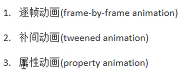

## 帧

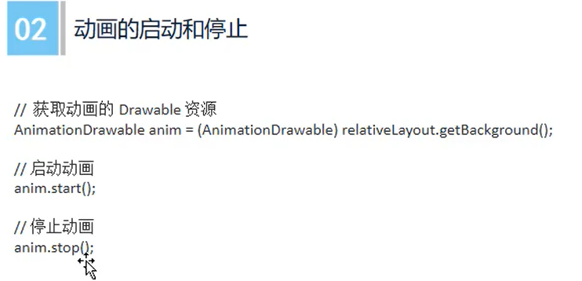

```xml
<?xml version="1.0" encoding="utf-8"?>
<animation-list xmlns:android="http://schemas.android.com/apk/res/android"
    xmlns:tools="http://schemas.android.com/tools">

    <item
        android:drawable="@drawable/test01"
        android:duration="120" />
    <item
        android:drawable="@drawable/test02"
        android:duration="120" />
    <item
        android:drawable="@drawable/test03"
        android:duration="120" />
    <item
        android:drawable="@drawable/test04"
        android:duration="120" />
    <item
        android:drawable="@drawable/test05"
        android:duration="120" />

</animation-list>
```

```java
public class MainActivity extends AppCompatActivity {

    boolean flag = true;

    @Override
    protected void onCreate(Bundle savedInstanceState) {
        super.onCreate(savedInstanceState);
        setContentView(R.layout.activity_main);

        RelativeLayout rl = findViewById(R.id.rl);

        AnimationDrawable ad = (AnimationDrawable) rl.getBackground();

        rl.setOnClickListener(new View.OnClickListener() {
            @Override
            public void onClick(View v) {
                if (flag) {
                    ad.start();
                } else {
                    ad.stop();
                }
                flag = !flag;
            }
        });
    }
}
```

## 补间动画

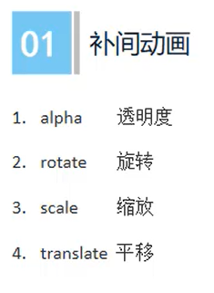

```xml
<?xml version="1.0" encoding="utf-8"?>
<set xmlns:android="http://schemas.android.com/apk/res/android">

    <alpha
        android:duration="2000"
        android:fromAlpha="0"
        android:toAlpha="1" />

    <rotate
        android:duration="2000"
        android:fromDegrees="0"
        android:pivotX="50%"
        android:pivotY="50%"
        android:toDegrees="720" />

    <scale
        android:duration="2000"
        android:fromXScale="1"
        android:fromYScale="1"
        android:pivotX="50%"
        android:pivotY="50%"
        android:toXScale="0.5"
        android:toYScale="0.5" />

    <translate
        android:duration="2000"
        android:fromXDelta="0"
        android:fromYDelta="0"
        android:toXDelta="400"
        android:toYDelta="400" />

</set>
```

```java
        //补间动画
        ImageView iv = findViewById(R.id.iv);
        iv.setOnClickListener(new View.OnClickListener() {
            @Override
            public void onClick(View v) {
                //加载xml动画设置文件来创建animation对象
                Animation animation = AnimationUtils.loadAnimation(MainActivity.this, R.anim.anime_01);
                iv.startAnimation(animation);
            }
        });
```


## 属性动画

### （1）ValueAnimator

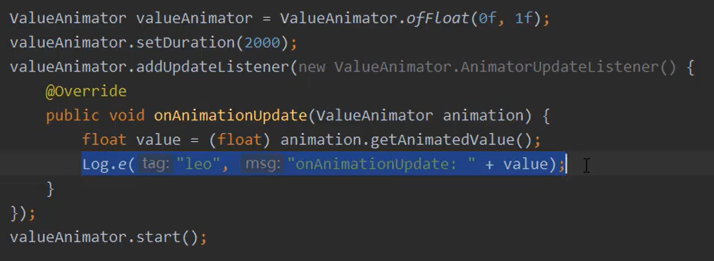

```
//这是一个值 其中打印的 value为浮点数 从 0 增加至 1
```

### （2）ObjectAnimator

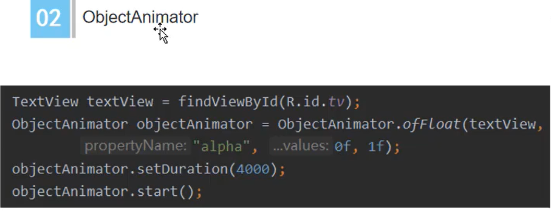

```
//图示 textView的alpha由浮点数从0到1
```

### （3）监听器

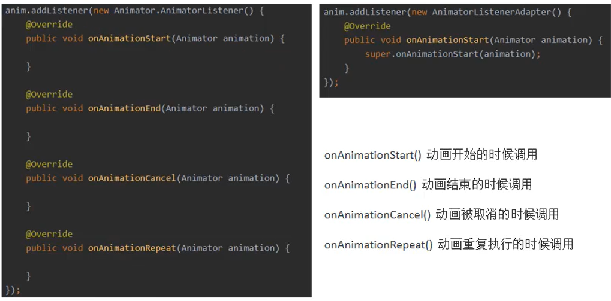

```
//图示 anim为ObjectAnimator
```

# 19.单位与尺寸

px与pt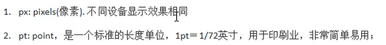

dp与sp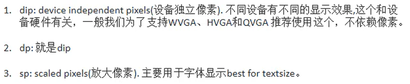

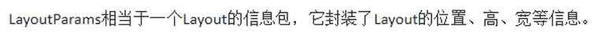

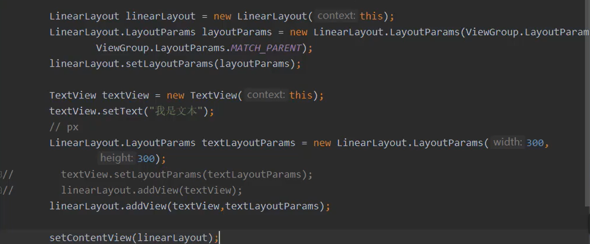

# 20.ViewPaper

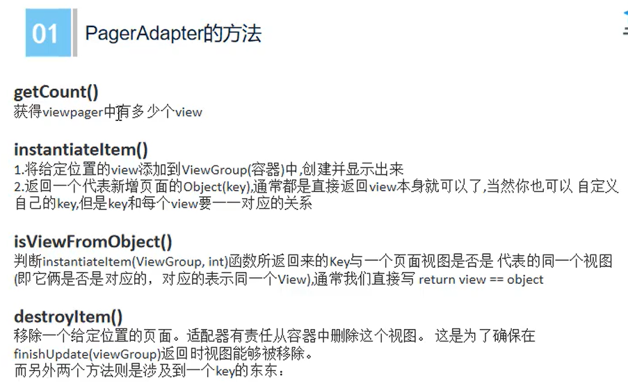

```java
//MainActivity
package com.eninix.my_viewpager;

import androidx.appcompat.app.AppCompatActivity;
import androidx.viewpager.widget.ViewPager;

import android.os.Bundle;
import android.view.LayoutInflater;
import android.view.View;

import java.util.ArrayList;
import java.util.List;

public class MainActivity extends AppCompatActivity {

    @Override
    protected void onCreate(Bundle savedInstanceState) {
        super.onCreate(savedInstanceState);
        setContentView(R.layout.activity_main);

        //渲染每个页面到View
        LayoutInflater layoutInflater = getLayoutInflater().from(this);
        View view1 = layoutInflater.inflate(R.layout.layout1, null);
        View view2 = layoutInflater.inflate(R.layout.layout2, null);
        View view3 = layoutInflater.inflate(R.layout.layout3, null);
        //将渲染好的页面放入List
        List<View> data = new ArrayList<>();
        data.add(view1);
        data.add(view2);
        data.add(view3);
        //获取 viewPager
        ViewPager viewPager = findViewById(R.id.vp);
        //自适应设置
        viewPager.setAdapter(new MyAdapter(data));

    }
}
```

```java
//MyAdapter
package com.eninix.my_viewpager;

import android.view.View;
import android.view.ViewGroup;

import androidx.annotation.NonNull;
import androidx.viewpager.widget.PagerAdapter;

import org.jetbrains.annotations.NotNull;

import java.util.List;

public class MyAdapter extends PagerAdapter {

    private List<View> mListView;

    public MyAdapter(List<View> mListView) {
        this.mListView = mListView;
    }

    @NonNull
    @org.jetbrains.annotations.NotNull
    @Override
    public Object instantiateItem(@NonNull @org.jetbrains.annotations.NotNull ViewGroup container, int position) {
        //把pager添加到container里面去
        container.addView(mListView.get(position), 0);
        //返回mListView.get(position)
        return mListView.get(position);
    }

    //销毁
    @Override
    public void destroyItem(@NonNull @NotNull ViewGroup container, int position, @NonNull @NotNull Object object) {
        //通过container去销毁
        container.removeView(mListView.get(position));
    }

    //pager的数量
    @Override
    public int getCount() {
        return mListView.size();
    }

    //View是否等于Object
    @Override
    public boolean isViewFromObject(@NonNull @org.jetbrains.annotations.NotNull View view, @NonNull @org.jetbrains.annotations.NotNull Object object) {
        return view == object;
    }
}

```

# 21.Fragment

## 基础

```java
//Fragment_1
package com.eninix.myfragent;

import android.os.Bundle;

import androidx.fragment.app.Fragment;

import android.view.LayoutInflater;
import android.view.View;
import android.view.ViewGroup;
import android.widget.Button;
import android.widget.TextView;

public class Fragment_1 extends Fragment {

    //根源view，指fragment layout布局
    private View rootView;
    //布局中的一些控件
    private TextView textView;
    private Button button;


    @Override
    public void onCreate(Bundle savedInstanceState) {
        super.onCreate(savedInstanceState);

    }
    @Override
    public View onCreateView(LayoutInflater inflater,
                             ViewGroup container,
                             Bundle savedInstanceState) {
        //rootView渲染
        if (rootView == null) {
            rootView = inflater.inflate(R.layout.fragment_1, container, false);
        }
        //控件获取
        textView = rootView.findViewById(R.id.textView);
        button = rootView.findViewById(R.id.button);

        //按钮绑定点击事件
        button.setOnClickListener(new View.OnClickListener() {
            @Override
            public void onClick(View v) {
                textView.setText("你点个锤子的按钮！");
            }
        });
        return rootView; //
    }
}
```

```xml
<?xml version="1.0" encoding="utf-8"?>
<LinearLayout xmlns:android="http://schemas.android.com/apk/res/android"
    xmlns:app="http://schemas.android.com/apk/res-auto"
    xmlns:tools="http://schemas.android.com/tools"
    android:layout_width="match_parent"
    android:layout_height="match_parent"
    android:orientation="vertical"
    tools:context=".MainActivity">

    <fragment
        android:id="@+id/fragment_1"
        android:name="com.eninix.myfragent.Fragment_1"
        android:layout_width="match_parent"
        android:layout_height="0dp"
        android:layout_weight="1" />

    <fragment
        android:id="@+id/fragment_2"
        android:name="com.eninix.myfragent.Fragment_1"
        android:layout_width="match_parent"
        android:layout_height="0dp"
        android:layout_weight="1" />

</LinearLayout>
```

## 动态创建与添加

```java
package com.eninix.androidstudyfragment;

import androidx.appcompat.app.AppCompatActivity;
import androidx.fragment.app.Fragment;
import androidx.fragment.app.FragmentManager;
import androidx.fragment.app.FragmentTransaction;

import android.os.Bundle;
import android.view.View;
import android.widget.Button;

public class MainActivity extends AppCompatActivity implements View.OnClickListener {

    Button button1;
    Button button2;

    @Override
    protected void onCreate(Bundle savedInstanceState) {
        super.onCreate(savedInstanceState);
        setContentView(R.layout.activity_main);

        //获取按钮
        button1 = findViewById(R.id.button1);
        button2 = findViewById(R.id.button2);
        //设置按钮监听 到 本类继承的 OnClick接口
        button1.setOnClickListener(this);
        button2.setOnClickListener(this);

    }

    @Override
    public void onClick(View view) {
        switch (view.getId()) {
            case R.id.button1:
                replaceFragment(new BlankFragment());
                break;
            case R.id.button2:
                replaceFragment(new ItemFragment());
                break;
        }
    }

    //动态切换fragment
    private void replaceFragment(Fragment fragment) {

        //通过FragmentManager创建FragmentTransaction
        FragmentManager fragmentManager = getSupportFragmentManager();
        FragmentTransaction fragmentTransaction = fragmentManager.beginTransaction();
        //通过FragmentTransaction动态修改
        fragmentTransaction.add(R.id.frameLayout, fragment);
        fragmentTransaction.addToBackStack(null); //添加到相同的栈里面去，可以是用返回键撤操作
        fragmentTransaction.commit();

    }

}
```

```xml
<?xml version="1.0" encoding="utf-8"?>
<LinearLayout xmlns:android="http://schemas.android.com/apk/res/android"
    xmlns:app="http://schemas.android.com/apk/res-auto"
    xmlns:tools="http://schemas.android.com/tools"
    android:layout_width="match_parent"
    android:layout_height="match_parent"
    android:orientation="vertical"
    tools:context=".MainActivity">

    <Button
        android:id="@+id/button1"
        android:layout_width="match_parent"
        android:layout_height="wrap_content"
        android:text="Change" />

    <Button
        android:id="@+id/button2"
        android:layout_width="match_parent"
        android:layout_height="wrap_content"
        android:text="Replace" />

    <FrameLayout
        android:id="@+id/frameLayout"
        android:layout_width="match_parent"
        android:layout_height="match_parent"
        android:background="@color/teal_200" />

</LinearLayout>
```


