# 1.TextView

## 1.1基础属性详解

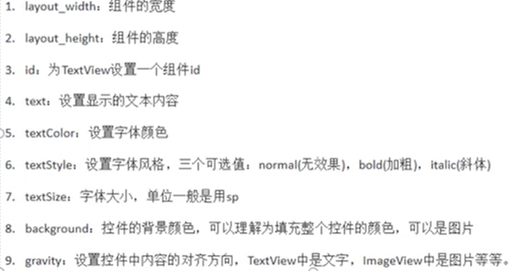

## 1.2带阴影的textview


## 1.3实现跑马灯效果的textview

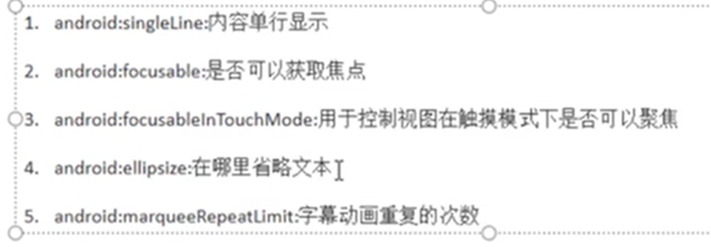

### 1.3.1自动获取焦点

```java
package com.eninix.androidtest;

import android.content.Context;
import android.util.AttributeSet;
import android.widget.TextView;

import androidx.annotation.Nullable;

public class MyTextView extends TextView {

    public MyTextView(Context context) {
        super(context);
    }

    public MyTextView(Context context, @Nullable AttributeSet attrs) {
        super(context, attrs);
    }

    public MyTextView(Context context, @Nullable AttributeSet attrs, int defStyleAttr) {
        super(context, attrs, defStyleAttr);
    }

    @Override
    public boolean isFocused() {
        return true;
    }
}
```

```xml
<?xml version="1.0" encoding="utf-8"?>
<LinearLayout xmlns:android="http://schemas.android.com/apk/res/android"
    android:layout_width="match_parent"
    android:layout_height="match_parent"
    android:orientation="vertical">

    <com.eninix.androidtest.MyTextView
        android:id="@+id/tv_one"

        android:layout_width="match_parent"
        android:layout_height="200dp"
        android:background="@color/red"

        android:singleLine="true"
        android:ellipsize="marquee"
        android:marqueeRepeatLimit="marquee_forever"
        android:focusable="true"
        android:focusableInTouchMode="true"
        android:clickable="true"

        android:shadowColor="@color/teal_200"
        android:shadowDx="10"
        android:shadowDy="10"
        android:shadowRadius="10"

        android:gravity="center_vertical"
        android:text="@string/tv_one"
        android:textColor="@color/black"
        android:textSize="40sp"
        android:textStyle="italic" />

</LinearLayout>
```

或者

```xml
<?xml version="1.0" encoding="utf-8"?>
<LinearLayout xmlns:android="http://schemas.android.com/apk/res/android"
    android:layout_width="match_parent"
    android:layout_height="match_parent"
    android:orientation="vertical">

    <TextView
        android:id="@+id/tv_one"

        android:layout_width="match_parent"
        android:layout_height="200dp"
        android:background="@color/red"

        android:singleLine="true"
        android:ellipsize="marquee"
        android:marqueeRepeatLimit="marquee_forever"
        android:focusable="true"
        android:focusableInTouchMode="true"
        android:clickable="true"

        android:shadowColor="@color/teal_200"
        android:shadowDx="10"
        android:shadowDy="10"
        android:shadowRadius="10"

        android:gravity="center_vertical"
        android:text="@string/tv_one"
        android:textColor="@color/black"
        android:textSize="40sp"
        android:textStyle="italic" >

        <requestFocus/>
    </TextView>

</LinearLayout>
```

# 2.Button

## 2.1StateListDrawable

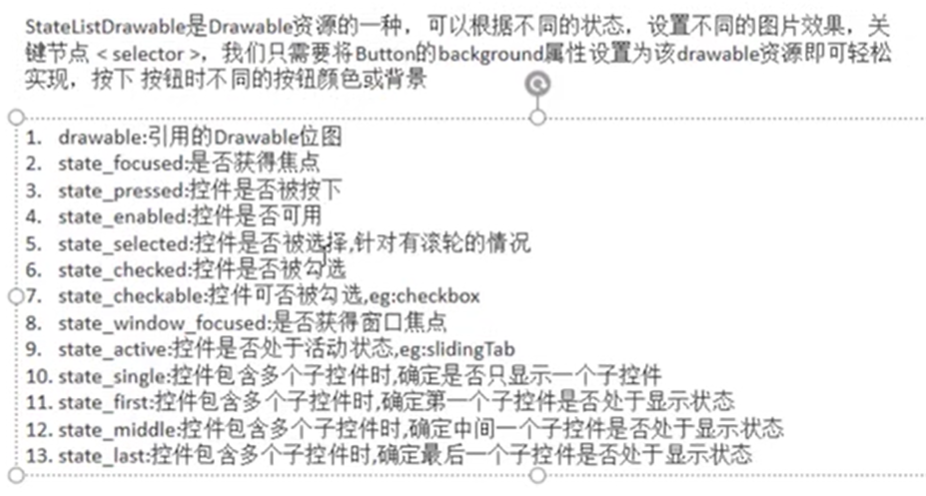

```xml
<?xml version="1.0" encoding="utf-8"?>
<LinearLayout xmlns:android="http://schemas.android.com/apk/res/android"
    android:layout_width="match_parent"
    android:layout_height="match_parent"
    android:orientation="vertical">

    <Button
        android:layout_width="200dp"
        android:layout_height="100dp"
        android:background="@drawable/btn_color_selector"
        android:textColor="@color/black"
        android:text="普通の釦">
    </Button>

</LinearLayout>
```

## 2.2Button事件处理

```java
package com.eninix.androidtest;

import androidx.appcompat.app.AppCompatActivity;

import android.os.Bundle;
import android.util.Log;
import android.view.MotionEvent;
import android.view.View;
import android.widget.Button;
import android.widget.TextView;

public class MainActivity extends AppCompatActivity {

    private static final String TAG = "eninix";

    @Override
    protected void onCreate(Bundle savedInstanceState) {
        super.onCreate(savedInstanceState);
        setContentView(R.layout.activity_main);

        TextView tv_one = findViewById(R.id.tv_one);
        // tv_one.setText("Hello World!");

        Button btn = findViewById(R.id.btn);

        // 点击事件
        btn.setOnClickListener(new View.OnClickListener() {
            @Override
            public void onClick(View v) {
                Log.e(TAG,"onClick");
            }
        });
        // 长按事件
        btn.setOnLongClickListener(new View.OnLongClickListener() {
            @Override
            public boolean onLongClick(View v) {
                Log.e(TAG,"onLongClick");
                return false; // 为true时,click不执行
            }
        });
        //触摸事件
        btn.setOnTouchListener(new View.OnTouchListener() {
            @Override
            public boolean onTouch(View v, MotionEvent event) {
                Log.e(TAG,"onTouch");
                return false; // 为true时,click和longclick不执行
            }
        });

    }
}
```

或者

```java
package com.eninix.androidtest;

import androidx.appcompat.app.AppCompatActivity;

import android.os.Bundle;
import android.util.Log;
import android.view.MotionEvent;
import android.view.View;
import android.widget.Button;
import android.widget.TextView;

public class MainActivity extends AppCompatActivity {

    private static final String TAG = "eninix";

    @Override
    protected void onCreate(Bundle savedInstanceState) {
        super.onCreate(savedInstanceState);
        setContentView(R.layout.activity_main);

    public void btnClick(View view) {
        
    }
}
    /*
       <Button
        android:id="@+id/btn"

        android:layout_width="200dp"
        android:layout_height="100dp"
        android:background="@drawable/btn_color_selector"

        android:onClick="btnClick" // 此处

        android:textColor="@color/black"
        android:text="普通の釦"/>
    */
```

# 3.EditText

```
android:hint 输入提示
android:textColorHint 输入提示文字的颜色
android:inputType 输入类型
android:drawableXxxx 输入框指定方位添加图片
android:drawablePadding 设置图片与输入内容间距
android:paddingXxxx 设置内容与边框间距
android:background 背景色
```

```java
package com.eninix.androidtest;

import androidx.appcompat.app.AppCompatActivity;

import android.os.Bundle;
import android.util.Log;
import android.view.MotionEvent;
import android.view.View;
import android.widget.Button;
import android.widget.EditText;
import android.widget.TextView;

public class MainActivity extends AppCompatActivity {

    private static final String TAG = "EGI";
    private EditText et;

    @Override
    protected void onCreate(Bundle savedInstanceState) {
        super.onCreate(savedInstanceState);
        setContentView(R.layout.activity_main);


        // coding...
        Button btn = findViewById(R.id.btn);
        et = findViewById(R.id.et);

        btn.setOnClickListener(new View.OnClickListener() {
            @Override
            public void onClick(View v) {
                String text = et.getText().toString();
                Log.e(TAG, text);
            }
        });

    }
}
```

```xml
<?xml version="1.0" encoding="utf-8"?>
<LinearLayout xmlns:android="http://schemas.android.com/apk/res/android"
    android:layout_width="match_parent"
    android:layout_height="match_parent"
    android:orientation="vertical">

    <EditText
        android:id="@+id/et"

        android:layout_width="250dp"
        android:layout_height="100dp"

        android:inputType="phone"

        android:hint="请输入用户名!"
        android:textColorHint="@color/black" />

    <EditText
        android:layout_width="250dp"
        android:layout_height="100dp"

        android:inputType="textPassword"

        android:drawableLeft="@drawable/ic_baseline_accessibility_24"
        android:paddingLeft="50dp"
        android:drawablePadding="30dp"

        android:hint="请输入用户名!"
        android:textColorHint="@color/black" />

    <Button

        android:id="@+id/btn"

        android:layout_width="wrap_content"
        android:layout_height="wrap_content"/>

</LinearLayout>
```

# 4.ImageView

```
android:src 图片资源
android:scaleType 图片缩放类型
android:maxHeigh 最大高
android:maxWidth 最大宽
android:adjustViewBounds 调整view界限 与上述最大宽高联合使用
```

## 4.1缩放类型

```
firStart 保持宽高比缩放,直至长边与imageview的边相等,缩放完成后置于ImageView左上角
fitCenter 同上,置于中间
fitEnd 同上,置于右下角
fitXY 拉伸
center 置于中心,超出部分裁剪处理
centerCrop 置于中心,等比缩放,直到完全覆盖imageview,超出部分裁剪处理
centerInside 置于中心,等比缩放,直至完全显示
matrix 不改变原图,从左上开始绘图,超出部分裁剪处理
```

# 5.ProgressBar

```
android:max 进度条最大值
android:progress 已完成进度
android:indeterminate 如果为true则不精确显示进度
style="?android:attr/progressBarStyleHorizontal" 水平进度条 //可能无用
style="@style/Widget.AppCompat.ProgressBar.Horizontal" 水平进度条
```

```java
public class MainActivity extends AppCompatActivity {

//     预定义一些进度条
    private ProgressBar progressBar;
    private ProgressBar progressBar2;

    @Override
    protected void onCreate(Bundle savedInstanceState) {
        super.onCreate(savedInstanceState);
        setContentView(R.layout.activity_main);

        progressBar = findViewById(R.id.pb);
        progressBar2 = findViewById(R.id.pd2);

    }

//    设置进度条的显示与隐藏
    public void bClick(View view) {
        progressBar.setVisibility(progressBar.getVisibility() == View.GONE ? View.VISIBLE : View.GONE);
    }

//    增加进度条的进度
    public void load(View view) {
        progressBar2.setProgress(progressBar2.getProgress() + 10);
    }
}
```

# 6.Notification

## 6.1

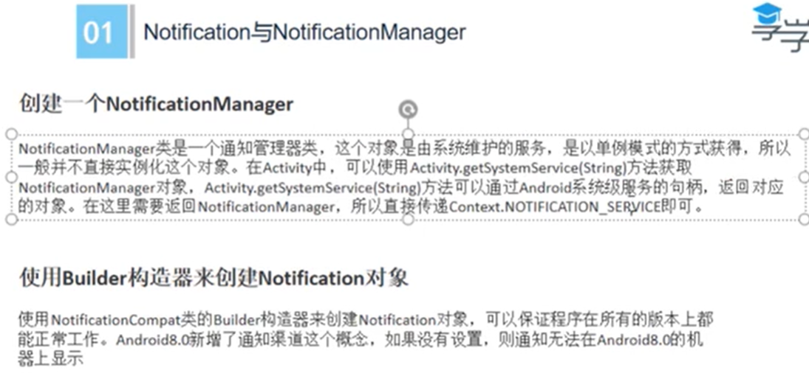

## 6.2

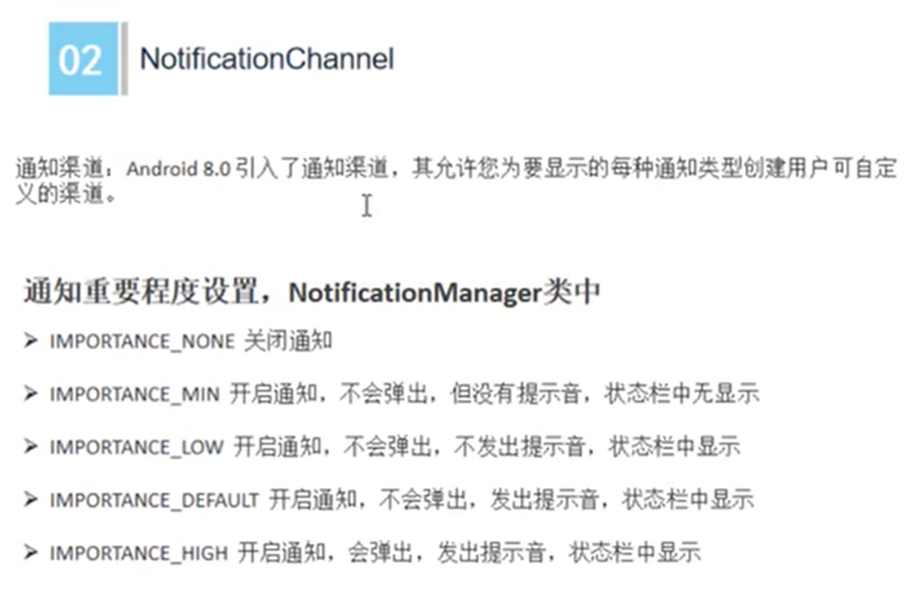

## 6.3

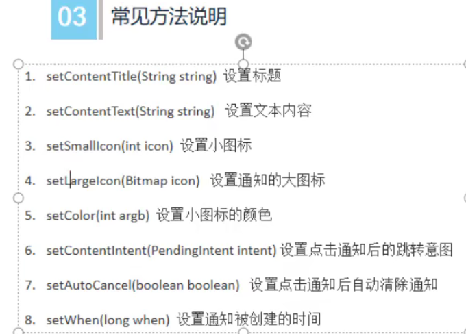

```java
public class MainActivity extends AppCompatActivity {

    // 创建 NotificationManager对象
    private NotificationManager manager;
    // 创建 Notification对象
    private Notification notification;

    @Override
    protected void onCreate(Bundle savedInstanceState) {
        super.onCreate(savedInstanceState);
        setContentView(R.layout.activity_main);

        //获取 NotificationManager对象
        manager = (NotificationManager) getSystemService(NOTIFICATION_SERVICE);

        //安卓8之后需要这个东西 NotificationChannel
        if (Build.VERSION.SDK_INT >= Build.VERSION_CODES.O) {
            NotificationChannel channel = new NotificationChannel("enin", "Test", NotificationManager.IMPORTANCE_HIGH);
            manager.createNotificationChannel(channel);
        }

        //设置通知信息
        notification = new NotificationCompat.Builder(this, "enin")
                .setContentTitle("致所有成员")   //标题
                .setContentText("世界はこんなに美しい、見付かなかった。") //内容
                .setSmallIcon(R.drawable.ic_test03) // 小图标  // 此及以上三个为必需
                .setLargeIcon(BitmapFactory.decodeResource(getResources(), R.drawable.test)) // 大图标  // 此及以下非必需
                .setColor(Color.parseColor("#ff0000")) // 小图标颜色
                .setAutoCancel(true) // 点击后自动取消
                .build();

    }

    //发送通知按钮所绑定的函数
    public void sendNotification(View view) {
        manager.notify(1, notification);
    }

    //消除通知…
    public void cacelNotification(View view) {
        manager.cancel(1);
    }
}
```

# 7.Toolbar

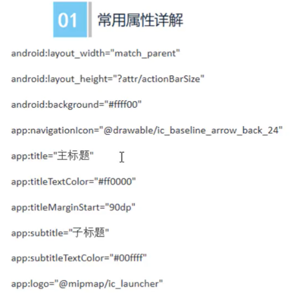

```xml
<?xml version="1.0" encoding="utf-8"?>
<LinearLayout xmlns:android="http://schemas.android.com/apk/res/android"
    xmlns:app="http://schemas.android.com/apk/res-auto"
    xmlns:tools="http://schemas.android.com/tools"
    android:layout_width="match_parent"
    android:layout_height="match_parent"
    android:orientation="vertical"
    tools:context=".MainActivity">

    <androidx.appcompat.widget.Toolbar
        android:id="@+id/tb"
        android:layout_width="match_parent"
        android:layout_height="?attr/actionBarSize"
        android:background="@color/teal_200"
        app:logo="@mipmap/ic_launcher_round"
        app:navigationIcon="@drawable/ic_menu"
        app:subtitle="这是子标题"
        app:subtitleTextColor="@color/teal_700"
        app:title="这是标题"
        app:titleMarginStart="50dp"
        app:titleTextColor="@color/red" />

    <androidx.appcompat.widget.Toolbar
        android:id="@+id/tb2"
        android:layout_width="match_parent"
        android:layout_height="?attr/actionBarSize"
        android:background="@color/teal_200"
        app:logo="@mipmap/ic_launcher_round"
        app:navigationIcon="@drawable/ic_menu"
        app:subtitle="这是子标题"
        app:subtitleTextColor="@color/teal_700"
        app:title="这是标题"
        app:titleMarginStart="50dp"
        app:titleTextColor="@color/red" />

    <androidx.appcompat.widget.Toolbar
        android:layout_width="match_parent"
        android:layout_height="?attr/actionBarSize"
        android:background="@color/teal_200"
        app:logo="@mipmap/ic_launcher_round"
        app:navigationIcon="@drawable/ic_menu"
        app:titleTextColor="@color/red">

        <TextView
            android:layout_width="wrap_content"
            android:layout_height="wrap_content"
            android:layout_gravity="center"
            android:gravity="center"
            android:text="标题-居中" />

    </androidx.appcompat.widget.Toolbar>
</LinearLayout>
```

```java
package com.eninix.my_toolbar;

import androidx.appcompat.app.AppCompatActivity;
import androidx.appcompat.widget.Toolbar;   //注意这里的包

import android.os.Bundle;
import android.util.Log;
import android.view.View;
import android.widget.QuickContactBadge;


public class MainActivity extends AppCompatActivity {

    Toolbar toolbar;
    Toolbar toolbar2;

    @Override
    protected void onCreate(Bundle savedInstanceState) {
        super.onCreate(savedInstanceState);
        setContentView(R.layout.activity_main);

        toolbar = findViewById(R.id.tb);

        //toolbar的navigationIcon被点击的事件
        toolbar.setNavigationOnClickListener(new View.OnClickListener() {
            @Override
            public void onClick(View v) {
                Log.e("enin", "tb被点击了");
            }
        });

        toolbar2 = findViewById(R.id.tb2);

        //在java里设置toolbar的属性
        toolbar2.setNavigationIcon(R.drawable.ic_back);
        toolbar2.setTitle("标题-java");
        toolbar2.setNavigationOnClickListener(new View.OnClickListener() {
            @Override
            public void onClick(View v) {
                Log.e("enin", "tb222被点击了");
            }
        });
    }
}
```

# 8.AlertDialog

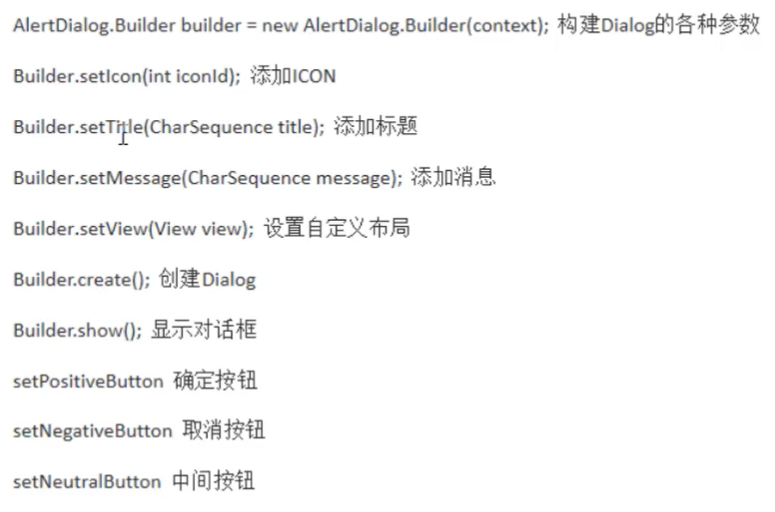

```java
package com.eninix.my_alertdialog;

import androidx.appcompat.app.AlertDialog;
import androidx.appcompat.app.AppCompatActivity;

import android.content.DialogInterface;
import android.os.Bundle;
import android.util.Log;
import android.view.View;

public class MainActivity extends AppCompatActivity {

    @Override
    protected void onCreate(Bundle savedInstanceState) {
        super.onCreate(savedInstanceState);
        setContentView(R.layout.activity_main);
    }

    public void bClick(View view) {
        // Dialog构建器
        AlertDialog.Builder builder = new AlertDialog.Builder(this);

        builder.setIcon(R.mipmap.ic_launcher_round)
                .setMessage("天気は良いから、散歩しましょう！")
                .setTitle("这是一个对话框")
                .setPositiveButton("下次不来了", new DialogInterface.OnClickListener() {
                    @Override
                    public void onClick(DialogInterface dialog, int which) {
                        Log.e("eninsay","111111");
                    }
                })
                .setNeutralButton("说不准", new DialogInterface.OnClickListener() {
                    @Override
                    public void onClick(DialogInterface dialog, int which) {
                        Log.e("eninsay","222222");
                    }
                })
                .setNegativeButton("下次再来", new DialogInterface.OnClickListener() {
                    @Override
                    public void onClick(DialogInterface dialog, int which) {
                        Log.e("eninsay","333333");
                    }
                })
                .setView(getLayoutInflater().inflate(R.layout.alertdialog_view,null))
                .create()   //此及以下两个需按顺序放在最后
                .show();
    }
}
```

```xml
<?xml version="1.0" encoding="utf-8"?>
<androidx.constraintlayout.widget.ConstraintLayout xmlns:android="http://schemas.android.com/apk/res/android"
    xmlns:app="http://schemas.android.com/apk/res-auto"
    xmlns:tools="http://schemas.android.com/tools"
    android:layout_width="match_parent"
    android:layout_height="match_parent"
    tools:context=".MainActivity">

    <Button
        android:layout_width="wrap_content"
        android:layout_height="wrap_content"
        android:onClick="bClick"
        android:text="显示对话框（AlertDialog）"
        app:layout_constraintBottom_toBottomOf="parent"
        app:layout_constraintEnd_toEndOf="parent"
        app:layout_constraintStart_toStartOf="parent"
        app:layout_constraintTop_toTopOf="parent"
        app:layout_constraintVertical_bias="0.499" />

</androidx.constraintlayout.widget.ConstraintLayout>
```


# 9.PopupWindow

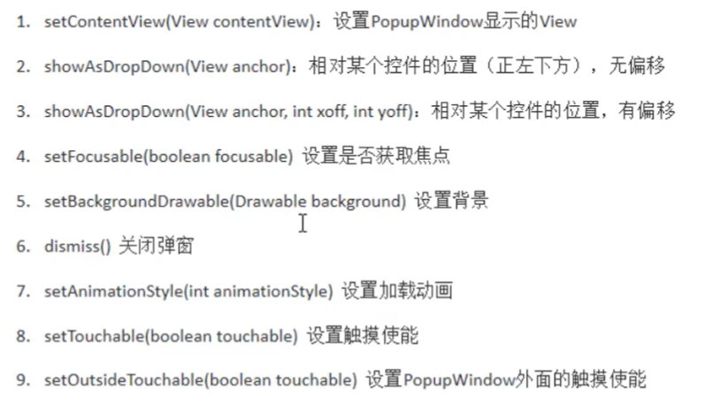

```java
package com.eninix.my_popupwindow;

import androidx.appcompat.app.AppCompatActivity;

import android.app.ActionBar;
import android.os.Bundle;
import android.view.View;
import android.widget.PopupWindow;

public class MainActivity extends AppCompatActivity {

    @Override
    protected void onCreate(Bundle savedInstanceState) {
        super.onCreate(savedInstanceState);
        setContentView(R.layout.activity_main);
    }

    public void bClick(View view) {

        //导入 view
        View popup_view = getLayoutInflater().inflate(R.layout.ppw_view, null);

        //创建 popupWindow 参数： view，宽，高，失去焦点隐藏
        PopupWindow popupWindow = new PopupWindow(popup_view,
                ActionBar.LayoutParams.WRAP_CONTENT, ActionBar.LayoutParams.WRAP_CONTENT
                , true);

        popupWindow.setBackgroundDrawable(getResources().getDrawable(R.drawable.test));

        //popupWindow.dismiss() 退出窗口

        //show 放在最后
        popupWindow.showAsDropDown(view);
    }
}
```

# 10LinearLayout

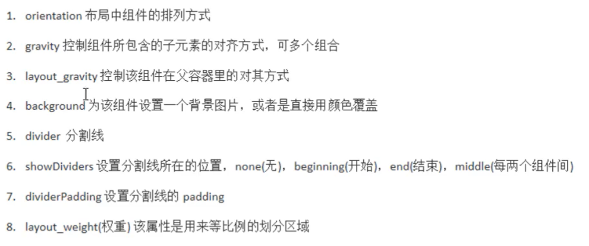


# 11.RelativeLayout

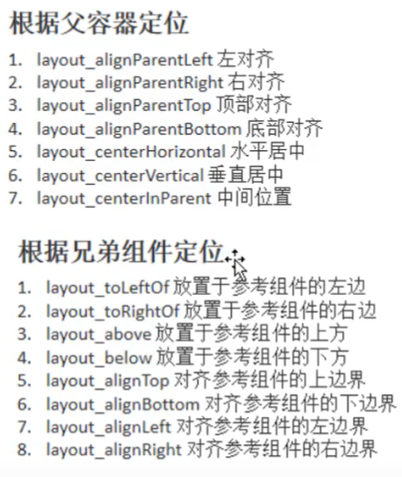

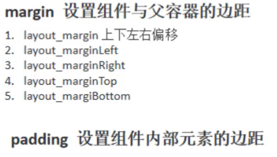

# 12.FrameLayout

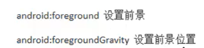


