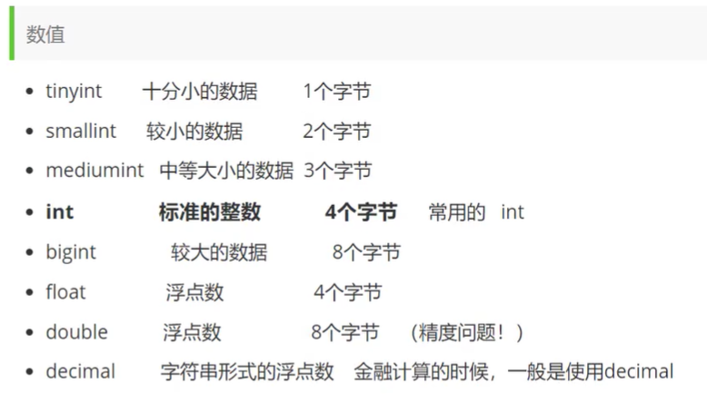
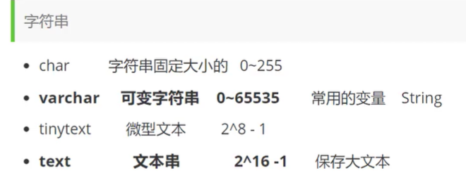
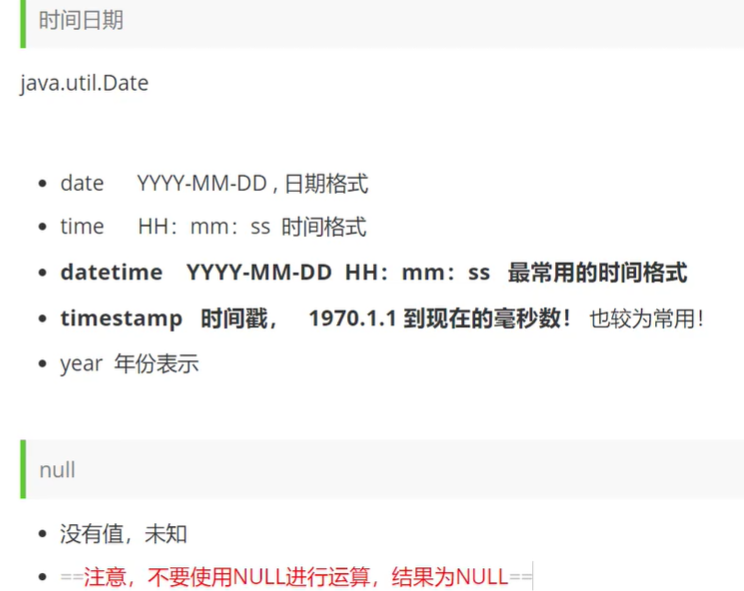

# 1.安装

## 1.1


```
update mysql.user set authentication_string=password('123456') where user='root' and Host = 'localhost';

mysql8 用：ALTER USER 'root'@'localhost' IDENTIFIED WITH mysql_native_password BY '123456';
```


## 1.2


# 2.操作数据库

## 1.创建

```sql
CREATE DATABASE [IF NOT EXISTS] westos;
```

## 2.删除

```sql
DROP DATABASE [IF EXISTS] westos;
```

## 3.使用

```sql
-- 如果你的表名或者字段名是特殊字符,则需要带上 `` 来包裹
USE `school`
```

## 4.查看

```sql
SHOW DATABASES; --查看所有数据库
```

# 3.数据库列类型








