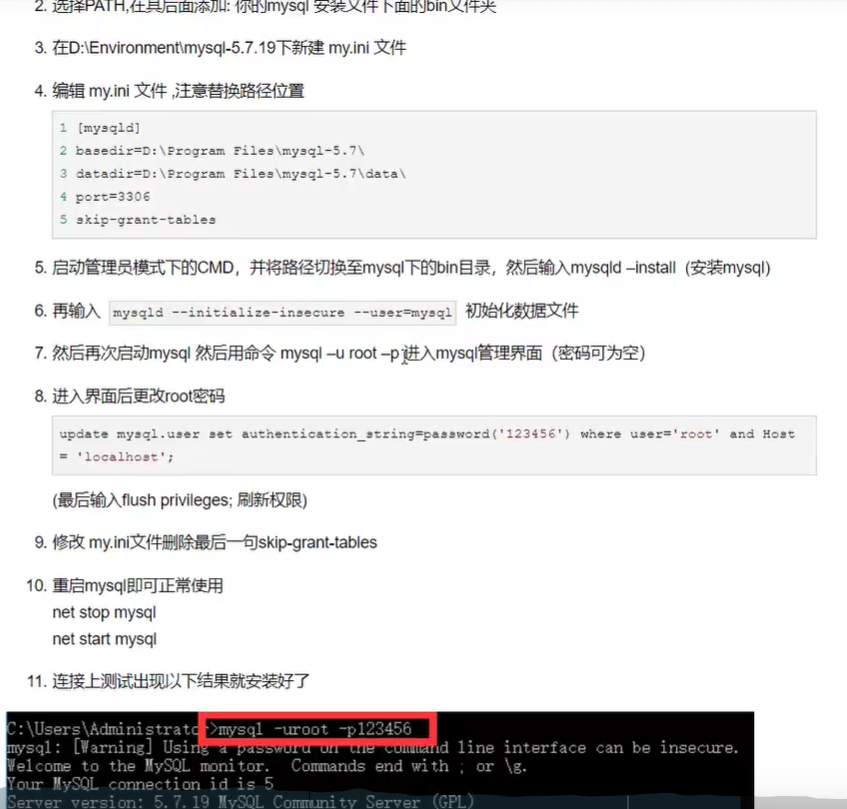
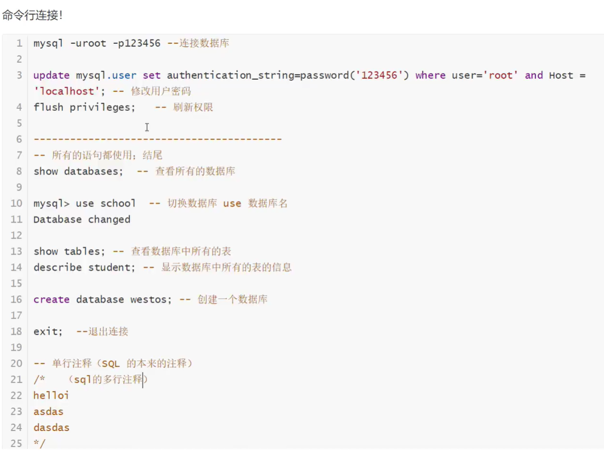

# 安装

## 1.1



```
update mysql.user set authentication_string=password('123456') where user='root' and Host = 'localhost';

mysql8 用：ALTER USER 'root'@'localhost' IDENTIFIED WITH mysql_native_password BY '123456';
```


## 1.2



# 操作数据库

## 1.创建

```
CREATE DATABASE IF NOT EXISTS westos;
```


## 2.删除


## 3.使用