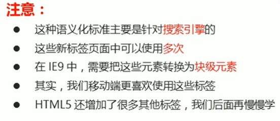
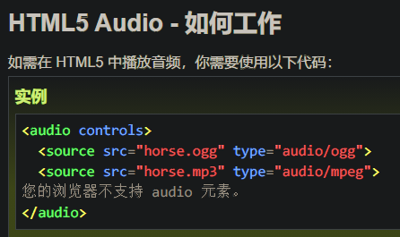

***目录***

[TOC]

---

# 1.HTML5新增语义标签

```html
<header> :头部标签
<nav> :导航标签
<article> :内容标签
<section> :定义文档某个区域
<aside> :侧边栏标签
<footer> :尾部标签    
```



# 2.HTML5新增多媒体标签

## HTML5新增视频\<video\>标签

```html
<video> :视频标签
```

视频\<video\>常见属性:

| 属性     | 值                                         | 描述                                                  |
| -------- | ------------------------------------------ | ----------------------------------------------------- |
| autoplay | autoplay                                   | 视频就绪自动播放(谷歌浏览器需要添加muted值来自动播放) |
| controls | controls                                   | 向用户显示播放控件                                    |
| width    | px                                         | 设置播放器宽度                                        |
| height   | px                                         | 设置播放器高度                                        |
| loop     | loop                                       | 播放完是否继续播放,循环播放                           |
| preload  | auto(预先加载视频)<br>none(不预先加载视频) | 规定是否预加载视频(如果有autoplay则忽略该属性)        |
| src      | 视频URL地址                                | 视频URL地址                                           |
| poster   | 图片URL地址                                | 加载时等待的画面图片                                  |
| muted    | muted                                      | 静音播放                                              |

## HTML5新增音频\<audio\>标签



# 3. intput 新增表单标签

## 类型


## 属性


